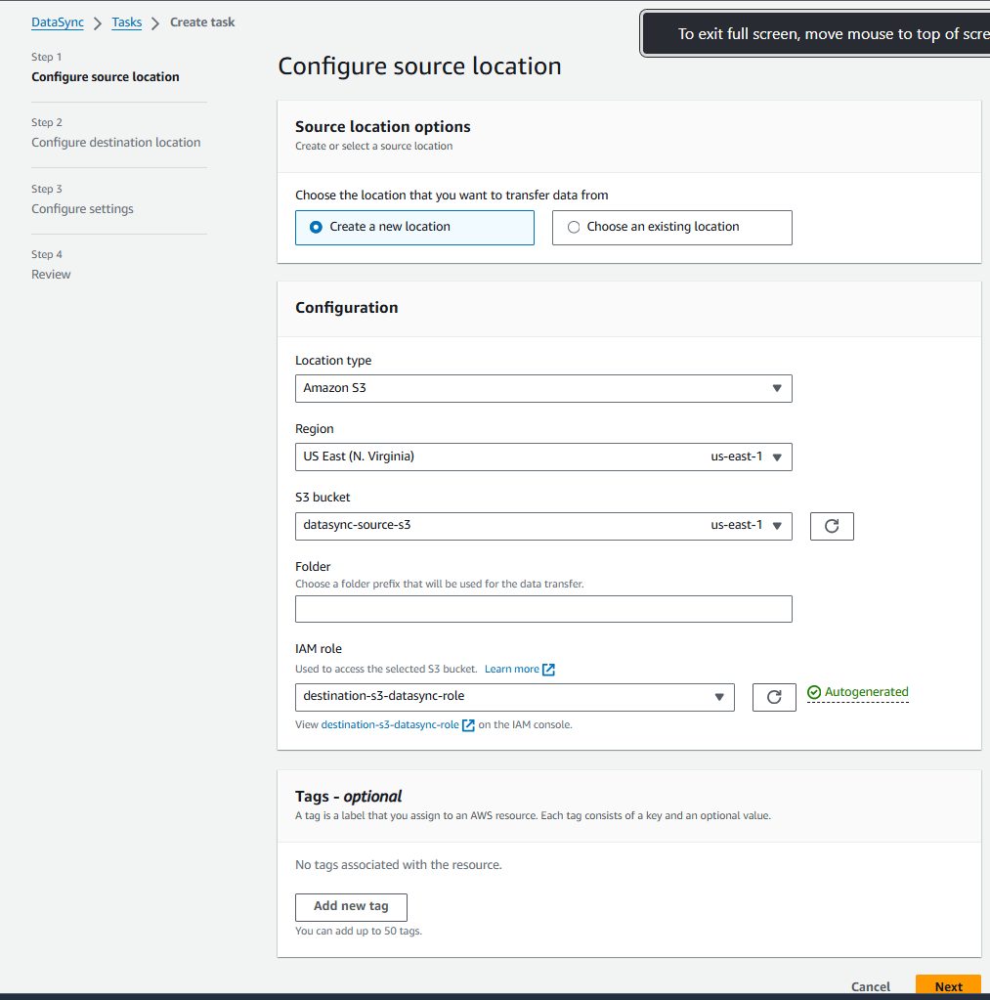

# Synchronizing S3 Buckets Across AWS Accounts Using AWS DataSync

### **Introduction**

This document outlines the steps to synchronize S3 buckets across different AWS accounts using AWS DataSync, a service designed for efficient data transfers between on-premises storage, Amazon S3 buckets, Amazon FSx for Windows File Server, and EFS file systems.

**Prerequisites**

- Two AWS accounts: A source account containing the S3 bucket you want to copy from and a destination account where you'll create the synchronized copy.
- IAM permissions:
    - In the source account, create an IAM role with permissions for DataSync to access the source bucket.
    - In the destination account, update the destination bucket policy to grant write access to the IAM role from the source account.
- An understanding of S3 buckets, IAM roles, and bucket policies.

### **Steps**

1. Create S3 buckets on two different accounts, where you need to perform the tasks.
    
    I created buckets as **datasync-source-s3** on account one and **datasync-destination-s32** on account two.
    Bucket policies for both the buckets are as below:
    
    **datasync-source-s3 policy:**
    
    ```json
    {
        "Version": "2012-10-17",
        "Statement": [
            {
                "Sid": "AllowDataSyncAccess",
                "Effect": "Allow",
                "Principal": {
                    "AWS": "arn:aws:iam::851725317538:role/destination-s3-datasync-role"
                },
                "Action": [
                    "s3:GetObject",
                    "s3:ListBucket"
                ],
                "Resource": [
                    "arn:aws:s3:::datasync-source-s3",
                    "arn:aws:s3:::datasync-source-s3/*"
                ]
            }
        ]
    }
    ```
    
    **datasync-destination-s32 policy**
    
    ```json
    {
        "Version": "2008-10-17",
        "Statement": [
            {
                "Sid": "DataSyncCreateS3LocationAndTaskAccess",
                "Effect": "Allow",
                "Principal": {
                    "AWS": "arn:aws:iam::851725317538:role/destination-s3-datasync-role"
                },
                "Action": [
                    "s3:GetBucketLocation",
                    "s3:ListBucket",
                    "s3:ListBucketMultipartUploads",
                    "s3:AbortMultipartUpload",
                    "s3:DeleteObject",
                    "s3:GetObject",
                    "s3:ListMultipartUploadParts",
                    "s3:PutObject",
                    "s3:GetObjectTagging",
                    "s3:PutObjectTagging"
                ],
                "Resource": [
                    "arn:aws:s3:::datasync-destination-s32",
                    "arn:aws:s3:::datasync-destination-s32/*"
                ]
            },
            {
                "Sid": "DataSyncCreateS3Location",
                "Effect": "Allow",
                "Principal": {
                    "AWS": "arn:aws:iam::851725317538:user/datasync"
                },
                "Action": "s3:ListBucket",
                "Resource": "arn:aws:s3:::datasync-destination-s32"
            }
        ]
    }
    ```
    
2. Create a role that we defined in the bucket policies 
    - Created a role named **destination-s3-datasync-role** and attached policies [AWSDataSyncFullAccess](https://us-east-1.console.aws.amazon.com/iam/home?region=us-east-1#/policies/details/arn%3Aaws%3Aiam%3A%3Aaws%3Apolicy%2FAWSDataSyncFullAccess) and [AWSDataSyncReadOnlyAccess](https://us-east-1.console.aws.amazon.com/iam/home?region=us-east-1#/policies/details/arn%3Aaws%3Aiam%3A%3Aaws%3Apolicy%2FAWSDataSyncReadOnlyAccess).
    - Then Create an inline policy as below
        
        ```json
        {
            "Version": "2012-10-17",
            "Statement": [
                {
                    "Sid": "DataSyncFullAccessPermissions",
                    "Effect": "Allow",
                    "Action": [
                        "datasync:*",
                        "ec2:CreateNetworkInterface",
                        "ec2:CreateNetworkInterfacePermission",
                        "ec2:DeleteNetworkInterface",
                        "ec2:DescribeNetworkInterfaces",
                        "ec2:DescribeSecurityGroups",
                        "ec2:DescribeSubnets",
                        "ec2:DescribeVpcEndpoints",
                        "ec2:ModifyNetworkInterfaceAttribute",
                        "fsx:DescribeFileSystems",
                        "fsx:DescribeStorageVirtualMachines",
                        "elasticfilesystem:DescribeAccessPoints",
                        "elasticfilesystem:DescribeFileSystems",
                        "elasticfilesystem:DescribeMountTargets",
                        "iam:GetRole",
                        "iam:ListRoles",
                        "logs:CreateLogGroup",
                        "logs:DescribeLogGroups",
                        "logs:DescribeResourcePolicies",
                        "outposts:ListOutposts",
                        "s3:GetBucketLocation",
                        "s3:ListAllMyBuckets",
                        "s3:ListBucket",
                        "s3:ListBucketVersions",
                        "s3-outposts:ListAccessPoints",
                        "s3-outposts:ListRegionalBuckets"
                    ],
                    "Resource": "*"
                },
                {
                    "Sid": "DataSyncPassRolePermissions",
                    "Effect": "Allow",
                    "Action": [
                        "iam:PassRole"
                    ],
                    "Resource": "*",
                    "Condition": {
                        "StringEquals": {
                            "iam:PassedToService": [
                                "datasync.amazonaws.com"
                            ]
                        }
                    }
                }
            ]
        }
        ```
        

After all this we go to AWS shell of the source account and run below command to add the destination S3 as location in DataSync Service

```bash
aws datasync create-location-s3   --s3-bucket-arn arn:aws:s3:::datasync-destination-s32   --s3-config '{"BucketAccessRoleArn":"arn:aws:iam::851725317538:role/destination-s3-datasync-role"}'   --region us-east-1
```

Then we go to Datasync service on Source account and and create a task 

1. **Click on create a task** 
2. Then select create a new location from your source S3 and select it from drop down and click next and select the role you created.
    
    
    
3. Then on the destination select the destination you created by cli and click next.
    
    
    
4. Configure the options of the task as per your requirements and click next.
5. And then click on create task.

> When You create a task for the first time, you need to start it manually.
> 

<aside>
💡 Disabling ACL on bucket is not mandatory, I did it for simplicity.

</aside>