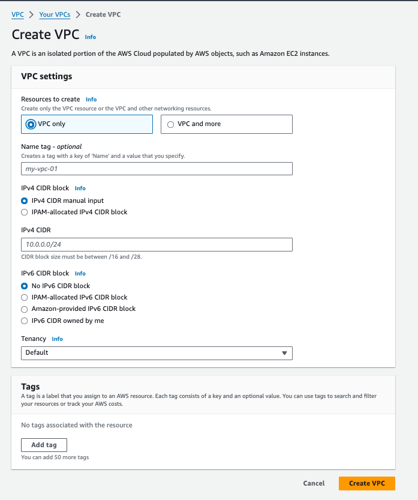

# Beanstalk Environment in VPC (Private) with Load Balancer

This page documents the deployment of a Beanstalk environment within a VPC configured for private access and utilising a load balancer

### Create a VPC

- Go to VPC Management Console
- Create VPC
- Choose Name and CIDR Block as per your Need

**VPC configuration we used.**

Then Create Subnets within the VPC you created

**Note:** To ensure high availability across Availability Zones (AZs), you'll need to create **one private subnet and one public subnet in each AZ**.

**In this example, we created a VPC with this configuration.**

## **Creating Public and Private Route Tables in AWS VPC Console**

**Steps:**

1. **Access the VPC Console:**
    - Open your web browser and navigate to the AWS Management Console: [https://aws.amazon.com/console/](https://aws.amazon.com/console/)
    - Log in to your AWS account with appropriate permissions.
    - In the search bar, type "VPC" and select "Amazon VPC" from the search results.
2. **Create Public and Private Route Tables:**
    - In the navigation pane on the left, under the "VPC" section, click on "Route Tables".
    - Click the button labeled "Create route table" twice.
    - Assign descriptive names to the route tables (e.g., "PublicRouteTable" and "PrivateRouteTable").
    - Select your VPC from the dropdown menu for each table (it should be pre-selected).
    - Click the button labeled "Create route table" for each table.
3. **Associate Subnets with Route Tables:**
    - Click on the name of the **PublicRouteTable**.
    - In the "Route Table" details pane, locate the section labeled "Subnet Associations".
    - Click the button labeled "Edit subnet associations".
    - Select the **public subnet(s)** from the available subnets list and click "Associate".
    - Repeat steps 3a-3c for the **PrivateRouteTable**, associating the corresponding **private subnet(s)**.
4. **Configure Internet Access:**
    - In the VPC console navigation pane, click on "Internet Gateways".
    - Click the button labeled "Create internet gateway".
    - Click "Create internet gateway" to confirm.
5. **Attach Internet Gateway to Public Subnet:**
    - In the VPC console navigation pane, click on "Subnet Associations" under the "Route Tables" section.
    - Click the checkbox next to the association that includes your **public subnet(s)** and the **PublicRouteTable**.
    - Click the "Actions" menu and select "Edit subnet associations".
    - Select the internet gateway you just created from the dropdown menu.
    - Click "Save".
6. **Configure NAT Gateway for Private Subnets:**
    - In the VPC console navigation pane, click on "NAT Gateways".
    - Click the button labeled "Create NAT Gateway".
    - Choose a public subnet from the dropdown menu (where you want to deploy the NAT Gateway).
    - Select an allocation size based on your internet traffic needs.
    - Click "Create NAT Gateway".
7. **Add Route to Private Route Table for NAT Gateway (if created):**
    - In the navigation pane, click on "Route Tables".
    - Click on the name of your **PrivateRouteTable**.
    - Click the button labeled "Actions" and select "Edit routes".
    - Click the button labeled "Add route".
    - In the "Destination" field, enter "0.0.0.0/0" for IPv4 traffic or "::/0" for IPv6 traffic.
    - In the "Target" field, select the NAT gateway you created from the dropdown menu.
    - Click "Save".

**Deployment Steps:**

1. **Create an Elastic Beanstalk Application:**
    - In the AWS Management Console, navigate to the Elastic Beanstalk service.
    - Click on "Create Application" and provide a unique application name.
    - Choose a platform based on your application requirements (e.g., Python, Node.js).
2. **Create a Beanstalk Environment:**
    - Select the previously created application.
    - Click on "Create Environment".
    - Choose an environment name.
    
    
    
    
    
3. **Configure Network Settings:**
    - Under "**Networking**", select "** VPC**".
    - Choose the previously created VPC from the dropdown menu.
4. **Configure Instance Settings:**
    - Under "**Instances**", select "**Private subnets**" and choose the private subnets (one per AZ) from the dropdown menus.
    - **Deselect** the "**Assign public IP addresses**" option.
    
    
    
5. **Configure Load Balancer Settings:**
    - Under "**Load balancer**", select "**Application Load Balancer**" (recommended for most applications).
    - Set "**Load balancer visibility**" to "**Internal**" as the environment is within a private VPC.
    - Choose the public subnets (one per AZ) from the "**Subnets**" dropdown menus.
6. **Configure Other Settings:**
    - Configure remaining environment settings as needed (e.g., instance type, environment variables).
7. **Create Environment:**
    - Review your configuration and click "**Create**" to deploy the Beanstalk environment.