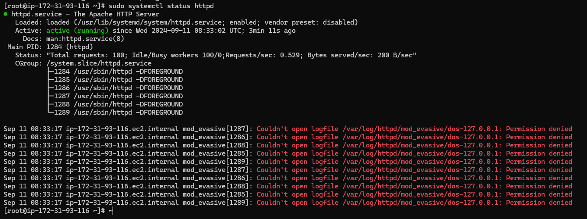
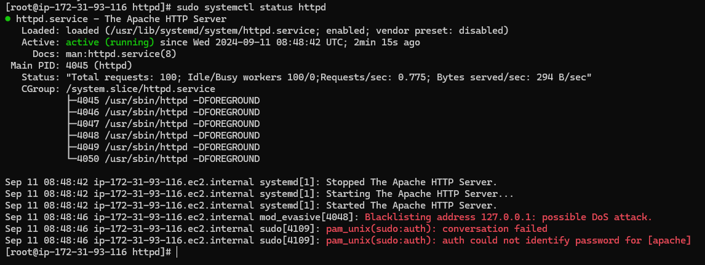

# Setup Mod_evasive with httpd on Amazon Linux 2

### Install httpd and mod_evasive

```bash
amazon-linux-extras enable epel
yum clean metadata
yum install epel-release
yum install httpd  mod_evasive.x86_64 -y
systemctl enable --now httpd

> /etc/httpd/conf.d/mod_evasive.conf

sudo bash -c 'cat <<EOF >> /etc/httpd/conf.d/mod_evasive.conf
<IfModule mod_evasive24.c>
    DOSHashTableSize 3097
    DOSPageCount 2
    DOSPageInterval 1
    DOSSiteCount 50
    DOSSiteInterval 1
    DOSBlockingPeriod 10
    DOSEmailNotify youremail@example.com
    DOSLogDir "/var/log/httpd/mod_evasive"
    DOSSystemCommand "sudo /sbin/iptables -I INPUT -s %s -j DROP"
    #DOSWhitelist 127.0.0.1
</IfModule>
EOF'


systemctl restart httpd

sudo truncate -s 0 /etc/httpd/conf.modules.d/00-mod_evasive.conf
echo 'LoadModule evasive20_module modules/mod_evasive24.so' | sudo tee -a /etc/httpd/conf.modules.d/00-mod_evasive.conf
sudo systemctl status httpd

```

### If you see a error like below Screenshot


Then 
```bash
chown -R apache.  /var/log/httpd/
chmod -R 774 /var/log/httpd/
systemctl restart httpd
```

### To test if our Mod_evasive Configuration is working or not you can see below command

```bash
for i in {1..100}; do curl -I http://localhost; done
```
Then Check the Status of httpd if the connection are getting blocked



