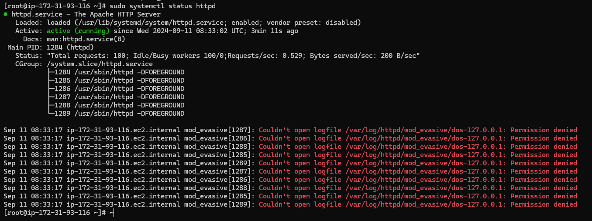

# Setup Mod_evasive with httpd on Amazon Linux 2

## 1. Install httpd and mod_evasive

To set up `mod_evasive` with `httpd` on Amazon Linux 2, follow these steps:

1. **Enable EPEL Repository and Install Packages:**

    ```bash
    amazon-linux-extras enable epel
    yum clean metadata
    yum install epel-release
    yum install httpd mod_evasive.x86_64 -y
    ```

2. **Enable and Start httpd Service:**

    ```bash
    systemctl enable --now httpd
    ```

## 2. Configure mod_evasive

1. **Create Configuration File:**

    Append the following configuration to the `/etc/httpd/conf.d/mod_evasive.conf` file:

    ```bash
    sudo bash -c 'cat <<EOF >> /etc/httpd/conf.d/mod_evasive.conf
    <IfModule mod_evasive24.c>
        DOSHashTableSize 3097
        DOSPageCount 2
        DOSPageInterval 1
        DOSSiteCount 50
        DOSSiteInterval 1
        DOSBlockingPeriod 10
        DOSEmailNotify youremail@example.com
        DOSLogDir "/var/log/httpd/mod_evasive"
        DOSSystemCommand "sudo /sbin/iptables -I INPUT -s %s -j DROP"
        #DOSWhitelist 127.0.0.1
    </IfModule>
    EOF'
    ```

2. **Restart httpd Service:**

    ```bash
    systemctl restart httpd
    ```

3. **Ensure mod_evasive Module is Loaded:**

    Clear the current configuration and ensure that `mod_evasive` is loaded:

    ```bash
    sudo truncate -s 0 /etc/httpd/conf.modules.d/00-mod_evasive.conf
    echo 'LoadModule evasive20_module modules/mod_evasive24.so' | sudo tee -a /etc/httpd/conf.modules.d/00-mod_evasive.conf
    ```

4. **Check httpd Status:**

    ```bash
    sudo systemctl status httpd
    ```

## 3. Troubleshooting: Permission Issues

If you encounter a permission error similar to the one shown below, adjust the permissions of the log directory:



1. **Update Ownership and Permissions:**

    ```bash
    chown -R apache. /var/log/httpd/
    chmod -R 774 /var/log/httpd/
    ```

2. **Restart httpd Service:**

    ```bash
    systemctl restart httpd
    ```

## 4. Testing mod_evasive Configuration

To verify that `mod_evasive` is functioning as expected, execute the following command:

```bash
for i in {1..100}; do curl -I http://localhost; done
```